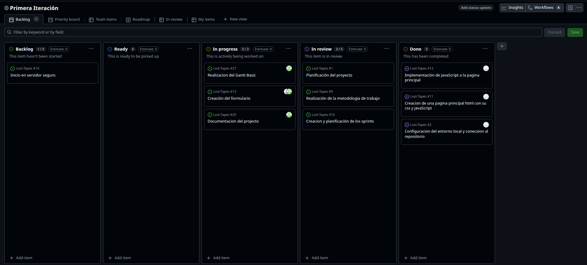

# COMO ARRANCAR EL SERVIDOR:
Colocamos en la terminal en la raíz del servidor el siguiente comando:

```bash
docker compose up -d
```

# DIRECCIONES WEB:
Para poder ver la pagina principal una vez que el servidor compose se haya iniciado será la siguiente URL:
```bash
http://localhost/index.html
```

Y el formulario de contacto podemos si ya entramos por la URL anterior clickear el apartado "Contacto" pero si quieres ver la URL aqui esta:
```bash
http://localhost/contacto.html
```


# KANBAN



# RIESGOS
Aqui tienes una redireccion al fichero que contiene la informacion sobre los riesgos
[Documentación de los riesgos](/docs/RISKS.md)


# GANT BASIC


# ROLES
[Documentación de los riesgos](/docs/roles.md)

